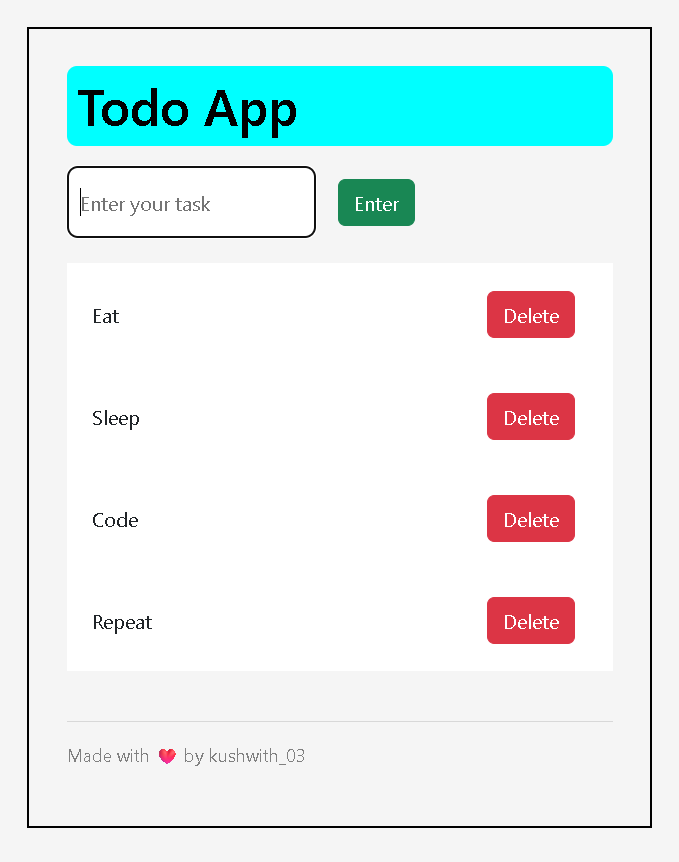

# To-Do List 📝

A simple and clean **To-Do List** app built using **HTML, CSS, and JavaScript** as part of my frontend web development learning journey. It allows users to add and delete tasks dynamically in a responsive user interface.

## 🖥️ Demo

[🔗 View Live Site](https://kushwith03.github.io/my-todo/) 

## 📚 What I Learned

- DOM manipulation with JavaScript
- Creating and appending elements dynamically
- Handling click events
- Responsive design using Flexbox and transitions

## 🛠 Features

- Add tasks
- Delete tasks
- Input validation
- Clean UI with basic styling
- Responsive on different devices

---

> 🚀 This project is a part of my front-end web development learning journey.
